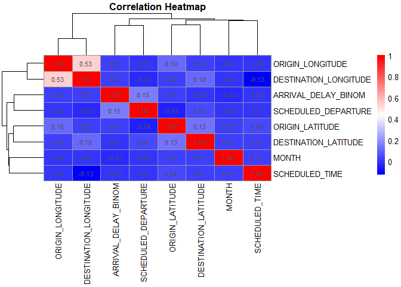
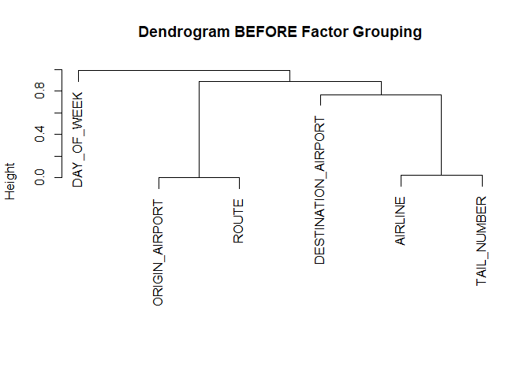
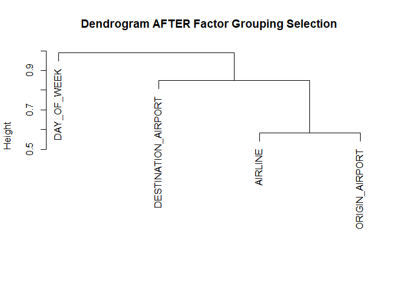
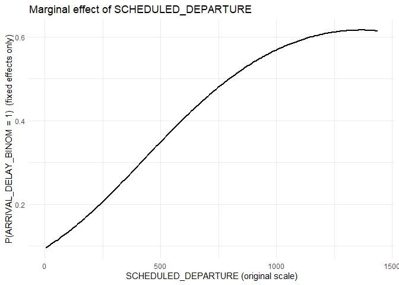
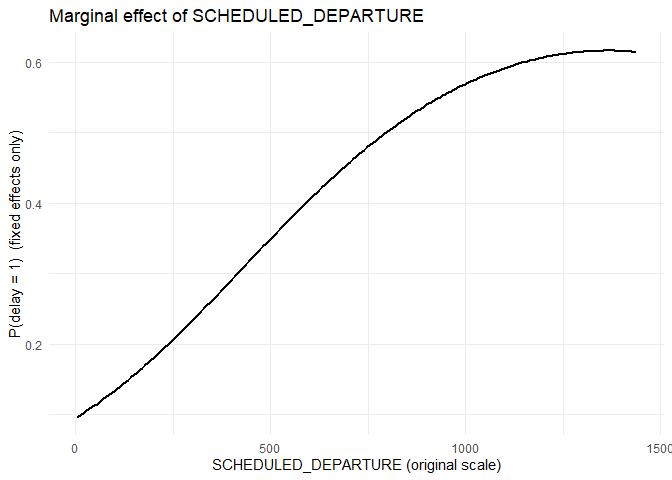
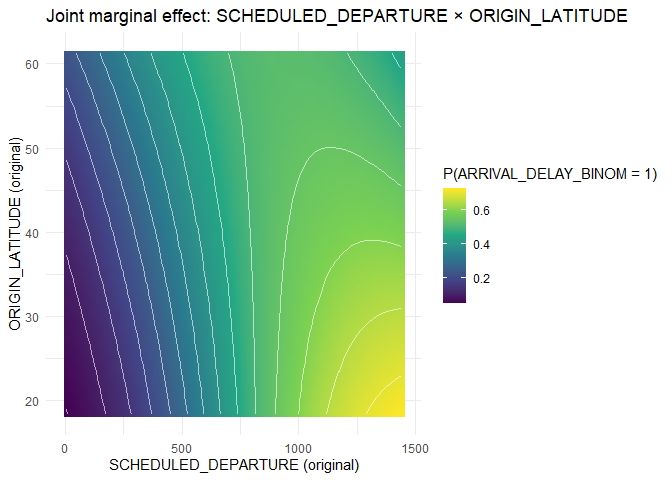
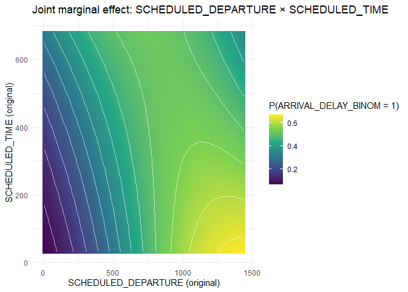

ExampleProject
================
2025-05-19

``` r
if ("GLMMPreprocessor" %in% rownames(installed.packages())) {
  remove.packages("GLMMPreprocessor")
}

devtools::install_github("alexChernikov1/GLMMPreprocessor", force = TRUE, upgrade = "never")
```

    ## ── R CMD build ─────────────────────────────────────────────────────────────────
    ##          checking for file 'C:\Users\alexc\AppData\Local\Temp\RtmpUHEeSM\remotes5a8437993cfb\alexChernikov1-GLMMPreprocessor-5e71504/DESCRIPTION' ...  ✔  checking for file 'C:\Users\alexc\AppData\Local\Temp\RtmpUHEeSM\remotes5a8437993cfb\alexChernikov1-GLMMPreprocessor-5e71504/DESCRIPTION'
    ##       ─  preparing 'GLMMPreprocessor':
    ##    checking DESCRIPTION meta-information ...     checking DESCRIPTION meta-information ...   ✔  checking DESCRIPTION meta-information
    ##       ─  checking for LF line-endings in source and make files and shell scripts
    ##   ─  checking for empty or unneeded directories
    ##      Omitted 'LazyData' from DESCRIPTION
    ##       ─  building 'GLMMPreprocessor_0.1.0.tar.gz'
    ##      
    ## 

``` r
# Load the package
library(GLMMPreprocessor)

library(usdm)
library(FactoMineR)
library(factoextra)
library(rpart.plot)
library(glmnet)
library(randomForest)
library(glmnet)
library(caret)
library(tidyr)
library(dplyr)
library(nlme)
library(lubridate)
library(lme4)
library(car)
library(lmerTest)  # For p-values in mixed models
library(ggplot2)
library(DescTools)  # for CramerV
library(mice)
library(httr)
library(jsonlite)
library(dplyr)
library(vcd)  
library(pheatmap)
library(dplyr)
library(ggplot2)
library(lubridate)
library(httr)
library(jsonlite)
library(FactoMineR)
library(factoextra)
library(glmnet)
library(dplyr)
library(randomForest)
library(pdp)
library(R6)
library(lme4)
library(dplyr)
library(tibble)
library(foreach)
library(doParallel)
```

``` r
load("~/GLMMPreprocessor_data/airtraffic.RData")
str(airtraffic)
```

    ## tibble [4,045,608 × 17] (S3: tbl_df/tbl/data.frame)
    ##  $ YEAR                 : num [1:4045608] 2015 2015 2015 2015 2015 ...
    ##  $ MONTH                : num [1:4045608] 1 1 1 1 1 1 1 1 1 1 ...
    ##  $ DAY                  : num [1:4045608] 1 1 1 1 1 1 1 1 1 1 ...
    ##  $ DAY_OF_WEEK          : Factor w/ 7 levels "1","2","3","4",..: 4 4 4 4 4 4 4 4 4 4 ...
    ##  $ AIRLINE              : Factor w/ 14 levels "AA","AS","B6",..: 2 1 12 1 2 4 9 12 1 4 ...
    ##  $ TAIL_NUMBER          : Factor w/ 4888 levels "7819A","7820L",..: 1618 1552 422 1512 2127 1137 2760 2405 1557 3929 ...
    ##  $ ORIGIN_AIRPORT       : Factor w/ 76 levels "ABQ","ANC","ATL",..: 2 36 67 36 66 67 35 36 67 35 ...
    ##  $ DESTINATION_AIRPORT  : Factor w/ 76 levels "ABQ","ANC","ATL",..: 66 54 15 44 2 46 46 15 21 3 ...
    ##  $ SCHEDULED_DEPARTURE  : num [1:4045608] 5 10 20 20 25 25 25 30 30 30 ...
    ##  $ SCHEDULED_TIME       : num [1:4045608] 205 280 286 285 235 217 181 273 195 221 ...
    ##  $ DISTANCE             : num [1:4045608] 1448 2330 2296 2342 1448 ...
    ##  $ ORIGIN_LATITUDE      : num [1:4045608] 61.2 33.9 37.6 33.9 47.4 ...
    ##  $ ORIGIN_LONGITUDE     : num [1:4045608] -150 -118 -122 -118 -122 ...
    ##  $ DESTINATION_LATITUDE : num [1:4045608] 47.4 26.7 35.2 25.8 61.2 ...
    ##  $ DESTINATION_LONGITUDE: num [1:4045608] -122.3 -80.1 -80.9 -80.3 -150 ...
    ##  $ ARRIVAL_DELAY_BINOM  : int [1:4045608] 0 0 0 0 0 0 0 0 0 0 ...
    ##  $ ROUTE                : Factor w/ 2735 levels "ABQ_ATL","ABQ_BWI",..: 38 1375 2420 1366 2356 2443 1308 1342 2425 1271 ...

``` r
# Step 1: Filter numeric features
cont_result <- invisible(remove_cont_multicollinearity(
  data                  = airtraffic,             # full dataframe
  target                = "ARRIVAL_DELAY_BINOM", # name of the target variable (must be 0/1 numeric or binary factor)
  target_cor_threshold  = 0.7,            # threshold to drop predictors highly correlated with target
  target_corr_last     = TRUE,
  cor_threshold         = 0.7,            # threshold to drop one of any two highly correlated predictors
  vif_threshold         = 5,              # max acceptable variance inflation factor
  verbose               = TRUE,           # print messages about dropped variables
  keep_cols             = c(),    # predictors you want to force-keep
  drop_cols             = c("DAY"),    # predictors you want to drop before filtering
  draw_corr             = TRUE           # whether to plot the correlation heatmap
))
```

    ## Dropped user-specified columns: DAY

    ## Dropping 'DISTANCE' corr> 0.7 with 'SCHEDULED_TIME'.

    ## 
    ## Feature Group summary (chosen / others):

    ##   Feature Group 1: MONTH

    ##   Feature Group 2: SCHEDULED_DEPARTURE

    ##   Feature Group 3: SCHEDULED_TIME  /  DISTANCE

    ##   Feature Group 4: ORIGIN_LATITUDE

    ##   Feature Group 5: ORIGIN_LONGITUDE

    ##   Feature Group 6: DESTINATION_LATITUDE

    ##   Feature Group 7: DESTINATION_LONGITUDE

    ##                                    variable cluster removed
    ## MONTH                                 MONTH       1   FALSE
    ## SCHEDULED_DEPARTURE     SCHEDULED_DEPARTURE       2   FALSE
    ## SCHEDULED_TIME               SCHEDULED_TIME       3   FALSE
    ## DISTANCE                           DISTANCE       3    TRUE
    ## ORIGIN_LATITUDE             ORIGIN_LATITUDE       4   FALSE
    ## ORIGIN_LONGITUDE           ORIGIN_LONGITUDE       5   FALSE
    ## DESTINATION_LATITUDE   DESTINATION_LATITUDE       6   FALSE
    ## DESTINATION_LONGITUDE DESTINATION_LONGITUDE       7   FALSE

<!-- -->

    ## 
    ## Before: 9 numeric cols; After: 7 retained.
    ## Retained columns:
    ## [1] "MONTH"                 "SCHEDULED_DEPARTURE"   "SCHEDULED_TIME"       
    ## [4] "ORIGIN_LATITUDE"       "ORIGIN_LONGITUDE"      "DESTINATION_LATITUDE" 
    ## [7] "DESTINATION_LONGITUDE"

``` r
# Step 2: Filter categorical features
cat_result <- invisible(remove_factor_multicollinearity(
  df             = airtraffic,                   # original dataframe with factors
  target_col     = "ARRIVAL_DELAY_BINOM",       # name of the target variable
  prune_target_assoc        = 0.7,    # new: Cramer's V threshold vs target
  prune_target_assoc_last   = TRUE,   # new: run target–assoc prune after clustering?
  keep_cols      = c(),          # factors you want to force-keep
  drop_cols      = c("DAY"),               # drop date before computing factor similarity
  k              = 4,                     # number of clusters to use in hierarchical clustering
  verbose        = TRUE
))
```

    ## Dropped user-specified columns: DAY

    ## Pruning numeric predictors: YEAR, MONTH, SCHEDULED_DEPARTURE, SCHEDULED_TIME, DISTANCE, ORIGIN_LATITUDE, ORIGIN_LONGITUDE, DESTINATION_LATITUDE, DESTINATION_LONGITUDE

<!-- -->

    ## 
    ## --- Cluster Membership and NA Counts ---
    ## # A tibble: 6 × 3
    ## # Groups:   cluster [4]
    ##   variable            cluster NA_count
    ##   <chr>               <chr>      <int>
    ## 1 DAY_OF_WEEK         1              0
    ## 2 AIRLINE             2              0
    ## 3 TAIL_NUMBER         2              0
    ## 4 ORIGIN_AIRPORT      3              0
    ## 5 ROUTE               3              0
    ## 6 DESTINATION_AIRPORT 4              0
    ## 
    ## Feature Group summary (chosen / others):
    ##   Feature Group 1: DAY_OF_WEEK
    ##   Feature Group 2: AIRLINE  /  TAIL_NUMBER
    ##   Feature Group 3: ORIGIN_AIRPORT  /  ROUTE
    ##   Feature Group 4: DESTINATION_AIRPORT

<!-- -->

    ## 
    ## Before: 6 factor cols; After: 4 retained.
    ## Retained columns:
    ## [1] "DAY_OF_WEEK"         "AIRLINE"             "ORIGIN_AIRPORT"     
    ## [4] "DESTINATION_AIRPORT"

``` r
# Step 3: Extract selected column names
numeric_cols     <- setdiff(names(cont_result$pruned_data), "ARRIVAL_DELAY_BINOM")  # selected numeric features
categorical_cols <- names(cat_result$pruned_data)                                   # selected factor features

# Step 4: Combine selected columns from original df
# Note: 'DAY' column is manually added back here if needed
df_cleaned <- airtraffic[, c("ARRIVAL_DELAY_BINOM", numeric_cols, categorical_cols), drop = FALSE]
```

``` r
print(str(df_cleaned))
```

    ## tibble [4,045,608 × 12] (S3: tbl_df/tbl/data.frame)
    ##  $ ARRIVAL_DELAY_BINOM  : int [1:4045608] 0 0 0 0 0 0 0 0 0 0 ...
    ##  $ MONTH                : num [1:4045608] 1 1 1 1 1 1 1 1 1 1 ...
    ##  $ SCHEDULED_DEPARTURE  : num [1:4045608] 5 10 20 20 25 25 25 30 30 30 ...
    ##  $ SCHEDULED_TIME       : num [1:4045608] 205 280 286 285 235 217 181 273 195 221 ...
    ##  $ ORIGIN_LATITUDE      : num [1:4045608] 61.2 33.9 37.6 33.9 47.4 ...
    ##  $ ORIGIN_LONGITUDE     : num [1:4045608] -150 -118 -122 -118 -122 ...
    ##  $ DESTINATION_LATITUDE : num [1:4045608] 47.4 26.7 35.2 25.8 61.2 ...
    ##  $ DESTINATION_LONGITUDE: num [1:4045608] -122.3 -80.1 -80.9 -80.3 -150 ...
    ##  $ DAY_OF_WEEK          : Factor w/ 7 levels "1","2","3","4",..: 4 4 4 4 4 4 4 4 4 4 ...
    ##  $ AIRLINE              : Factor w/ 14 levels "AA","AS","B6",..: 2 1 12 1 2 4 9 12 1 4 ...
    ##  $ ORIGIN_AIRPORT       : Factor w/ 76 levels "ABQ","ANC","ATL",..: 2 36 67 36 66 67 35 36 67 35 ...
    ##  $ DESTINATION_AIRPORT  : Factor w/ 76 levels "ABQ","ANC","ATL",..: 66 54 15 44 2 46 46 15 21 3 ...
    ## NULL

``` r
# Set modeling controls
random_effects  <- c("MONTH", "AIRLINE","ORIGIN_AIRPORT","DESTINATION_AIRPORT")   # grouping variables for random effects
no_interactions <- c()     # fixed effects to exclude from interaction terms
TRAIN_PCT       <- 0.005                                       # percentage of data to use for training
RAND_SEED       <- 663                                        # seed for reproducibility

# Prepare preprocessor
glmm <- GLMMPreprocessor$new(target = "ARRIVAL_DELAY_BINOM")      # initialize with binary target variable

# Apply to a single data frame
prep_out <- glmm$preprocess(
  df_cleaned,
  train_pct         = TRAIN_PCT,        # fraction of rows to use in training set
  undersample_train = TRUE,             # whether to undersample majority class
  random_state      = RAND_SEED         # seed for reproducible sampling
)
```

    ## After undersampling: train rows = 7558 (balanced 0/1)

``` r
fit_result <- glmm$stepwise_bic_glmm(
  X                 = prep_out$X,
  y                 = prep_out$y,
  random_effects    = random_effects,
  no_interactions   = no_interactions,
  poly              = 3,
  bic_tol           = 0.5,
  max_add_steps     = 1000,
  max_drop_steps    = 1000,
  cores             = max(1, parallel::detectCores() - 1),
  re_var_threshold  = 1e-6,
  int_var_threshold = 1e-6
)
```

    ## Fixed‑effect search space: 40 terms

    ##  +  I(SCHEDULED_DEPARTURE^2)  (BIC = 10095.3)

    ##  +  SCHEDULED_DEPARTURE:ORIGIN_LATITUDE  (BIC = 10092.16)

    ##  +  SCHEDULED_DEPARTURE:SCHEDULED_TIME  (BIC = 10089.59)

    ##  +  SCHEDULED_DEPARTURE:ORIGIN_LONGITUDE  (BIC = 10089.28)

    ##  +  SCHEDULED_DEPARTURE  (BIC = 10089.28)

    ##  +  ORIGIN_LONGITUDE  (BIC = 10090.71)

    ##  +  ORIGIN_LATITUDE:DESTINATION_LATITUDE  (BIC = 10094.52)

    ##  +  I(ORIGIN_LONGITUDE^3)  (BIC = 10100.15)

    ##  +  I(SCHEDULED_DEPARTURE^3)  (BIC = 10106.63)

    ##  +  ORIGIN_LATITUDE:ORIGIN_LONGITUDE  (BIC = 10113.9)

    ##  +  ORIGIN_LATITUDE:DESTINATION_LONGITUDE  (BIC = 10119.34)

    ##  +  SCHEDULED_DEPARTURE:DESTINATION_LATITUDE  (BIC = 10126.57)

    ##  +  I(ORIGIN_LONGITUDE^2)  (BIC = 10134.11)

    ##  +  ORIGIN_LONGITUDE:DESTINATION_LATITUDE  (BIC = 10141.62)

    ##  +  DESTINATION_LATITUDE:DESTINATION_LONGITUDE  (BIC = 10149.03)

    ##  +  SCHEDULED_DEPARTURE:DESTINATION_LONGITUDE  (BIC = 10156.58)

    ##  +  SCHEDULED_TIME:ORIGIN_LONGITUDE  (BIC = 10164.55)

    ##  +  SCHEDULED_TIME  (BIC = 10172.67)

    ##  +  DESTINATION_LATITUDE  (BIC = 10181.1)

    ##  +  I(SCHEDULED_TIME^2)  (BIC = 10189.57)

    ##  +  I(SCHEDULED_TIME^3)  (BIC = 10197.05)

    ##  +  ORIGIN_LATITUDE  (BIC = 10205.75)

    ##  +  I(ORIGIN_LATITUDE^3)  (BIC = 10213.56)

    ##  +  SCHEDULED_TIME:ORIGIN_LATITUDE  (BIC = 10222.3)

    ##  +  ORIGIN_LONGITUDE:DESTINATION_LONGITUDE  (BIC = 10231.06)

    ##  +  I(DESTINATION_LATITUDE^2)  (BIC = 10239.85)

    ##  +  DESTINATION_LONGITUDE  (BIC = 10248.47)

    ##  +  I(DESTINATION_LONGITUDE^2)  (BIC = 10252.29)

    ##  +  SCHEDULED_TIME:DESTINATION_LATITUDE  (BIC = 10259.55)

    ##  +  I(ORIGIN_LATITUDE^2)  (BIC = 10268.16)

    ##  +  SCHEDULED_TIME:DESTINATION_LONGITUDE  (BIC = 10276.81)

    ##  +  I(DESTINATION_LONGITUDE^3)  (BIC = 10285.56)

    ##  +  I(DESTINATION_LATITUDE^3)  (BIC = 10294.4)

    ##  +  DAY_OF_WEEK  (BIC = 10330.55)

    ##  +  DESTINATION_LATITUDE:DAY_OF_WEEK  (BIC = 10369.47)

    ##  +  ORIGIN_LONGITUDE:DAY_OF_WEEK  (BIC = 10413.7)

    ##  +  ORIGIN_LATITUDE:DAY_OF_WEEK  (BIC = 10461.01)

    ##  +  SCHEDULED_DEPARTURE:DAY_OF_WEEK  (BIC = 10509.78)

    ##  +  DESTINATION_LONGITUDE:DAY_OF_WEEK  (BIC = 10559.78)

    ##  +  SCHEDULED_TIME:DAY_OF_WEEK  (BIC = 10612.42)

    ##  -  SCHEDULED_TIME:DAY_OF_WEEK  (BIC = 10559.78)

    ##  -  DESTINATION_LONGITUDE:DAY_OF_WEEK  (BIC = 10509.78)

    ##  -  SCHEDULED_DEPARTURE:DAY_OF_WEEK  (BIC = 10461.01)

    ##  -  ORIGIN_LATITUDE:DAY_OF_WEEK  (BIC = 10413.7)

    ##  -  ORIGIN_LONGITUDE:DAY_OF_WEEK  (BIC = 10369.47)

    ##  -  DESTINATION_LATITUDE:DAY_OF_WEEK  (BIC = 10330.55)

    ##  -  DAY_OF_WEEK  (BIC = 10294.4)

    ##  -  I(DESTINATION_LATITUDE^3)  (BIC = 10285.56)

    ##  -  I(DESTINATION_LONGITUDE^3)  (BIC = 10276.81)

    ##  -  SCHEDULED_TIME:DESTINATION_LONGITUDE  (BIC = 10268.16)

    ##  -  I(ORIGIN_LATITUDE^2)  (BIC = 10259.55)

    ##  -  I(DESTINATION_LATITUDE^2)  (BIC = 10250.99)

    ##  -  SCHEDULED_TIME:ORIGIN_LONGITUDE  (BIC = 10242.46)

    ##  -  SCHEDULED_DEPARTURE:DESTINATION_LONGITUDE  (BIC = 10234.27)

    ##  -  I(ORIGIN_LATITUDE^3)  (BIC = 10226.33)

    ##  -  SCHEDULED_TIME:ORIGIN_LATITUDE  (BIC = 10218.21)

    ##  -  DESTINATION_LATITUDE  (BIC = 10210.55)

    ##  -  I(SCHEDULED_TIME^3)  (BIC = 10202.82)

    ##  -  ORIGIN_LATITUDE  (BIC = 10195.51)

    ##  -  SCHEDULED_DEPARTURE:DESTINATION_LATITUDE  (BIC = 10188.37)

    ##  -  SCHEDULED_TIME:DESTINATION_LATITUDE  (BIC = 10181.99)

    ##  -  DESTINATION_LATITUDE:DESTINATION_LONGITUDE  (BIC = 10174.22)

    ##  -  ORIGIN_LONGITUDE:DESTINATION_LATITUDE  (BIC = 10166.72)

    ##  -  I(DESTINATION_LONGITUDE^2)  (BIC = 10160.84)

    ##  -  DESTINATION_LONGITUDE  (BIC = 10151.91)

    ##  -  ORIGIN_LONGITUDE:DESTINATION_LONGITUDE  (BIC = 10143.15)

    ##  -  ORIGIN_LATITUDE:DESTINATION_LATITUDE  (BIC = 10135.22)

    ##  -  I(ORIGIN_LONGITUDE^2)  (BIC = 10127.65)

    ##  -  I(SCHEDULED_TIME^2)  (BIC = 10120.05)

    ##  -  SCHEDULED_TIME  (BIC = 10112.18)

    ##  -  I(SCHEDULED_DEPARTURE^3)  (BIC = 10106.18)

    ##  -  ORIGIN_LATITUDE:DESTINATION_LONGITUDE  (BIC = 10101.71)

    ##  -  ORIGIN_LATITUDE:ORIGIN_LONGITUDE  (BIC = 10094.68)

    ##  -  I(ORIGIN_LONGITUDE^3)  (BIC = 10090.71)

    ##  -  ORIGIN_LONGITUDE  (BIC = 10089.28)

    ##  -  SCHEDULED_DEPARTURE  (BIC = 10089.28)

    ##  -  SCHEDULED_DEPARTURE:ORIGIN_LONGITUDE  (BIC = 10089.59)

    ##  -  SCHEDULED_DEPARTURE:SCHEDULED_TIME  (BIC = 10092.16)

    ##  -  SCHEDULED_DEPARTURE:ORIGIN_LATITUDE  (BIC = 10095.3)

    ##  -  I(SCHEDULED_DEPARTURE^2)  (BIC = 10425.26)

``` r
print(fit_result$fit)
```

    ## Generalized linear mixed model fit by maximum likelihood (Adaptive
    ##   Gauss-Hermite Quadrature, nAGQ = 0) [glmerMod]
    ##  Family: binomial  ( logit )
    ## Formula: 
    ## ARRIVAL_DELAY_BINOM ~ I(SCHEDULED_DEPARTURE^2) + SCHEDULED_DEPARTURE:ORIGIN_LATITUDE +  
    ##     SCHEDULED_DEPARTURE:SCHEDULED_TIME + SCHEDULED_DEPARTURE:ORIGIN_LONGITUDE +  
    ##     SCHEDULED_DEPARTURE + (1 | MONTH) + (1 | AIRLINE) + (1 |  
    ##     ORIGIN_AIRPORT) + (1 | DESTINATION_AIRPORT)
    ##    Data: d
    ##       AIC       BIC    logLik  deviance  df.resid 
    ## 10019.979 10089.282 -4999.989  9999.979      7548 
    ## Random effects:
    ##  Groups              Name        Std.Dev.
    ##  DESTINATION_AIRPORT (Intercept) 0.2102  
    ##  ORIGIN_AIRPORT      (Intercept) 0.2083  
    ##  AIRLINE             (Intercept) 0.2391  
    ##  MONTH               (Intercept) 0.1812  
    ## Number of obs: 7558, groups:  
    ## DESTINATION_AIRPORT, 76; ORIGIN_AIRPORT, 76; AIRLINE, 14; MONTH, 11
    ## Fixed Effects:
    ##                          (Intercept)              I(SCHEDULED_DEPARTURE^2)  
    ##                              0.07756                              -0.12148  
    ##                  SCHEDULED_DEPARTURE   SCHEDULED_DEPARTURE:ORIGIN_LATITUDE  
    ##                              0.43755                              -0.08058  
    ##   SCHEDULED_DEPARTURE:SCHEDULED_TIME  SCHEDULED_DEPARTURE:ORIGIN_LONGITUDE  
    ##                             -0.07600                               0.07237

``` r
# Visualize marginal effect of a predictor
glmm$plot_marginal(
  model_fit = fit_result$fit,                   # fitted model
  df        = glmm$train_df,                    # training data used for centering/scaling
  focal_var = "SCHEDULED_DEPARTURE"                  # focal variable to visualize
)
```

<!-- -->

``` r
# Joint marginal effect (e.g., cubic schedule × distance)
glmm$plot_marginal_interaction(
  model_fit = fit_result$fit,                   # fitted model
  df        = glmm$train_df,                    # training data
  vars      = c("SCHEDULED_DEPARTURE", "ORIGIN_LONGITUDE")  # variables for interaction plot
)
```

<!-- -->

``` r
# Joint marginal effect (e.g., cubic schedule × distance)
glmm$plot_marginal_interaction(
  model_fit = fit_result$fit,                   # fitted model
  df        = glmm$train_df,                    # training data
  vars      = c("SCHEDULED_DEPARTURE", "ORIGIN_LATITUDE")  # variables for interaction plot
)
```

<!-- -->

``` r
# Joint marginal effect (e.g., cubic schedule × distance)
glmm$plot_marginal_interaction(
  model_fit = fit_result$fit,                   # fitted model
  df        = glmm$train_df,                    # training data
  vars      = c("SCHEDULED_DEPARTURE", "SCHEDULED_TIME")  # variables for interaction plot
)
```

<!-- -->
